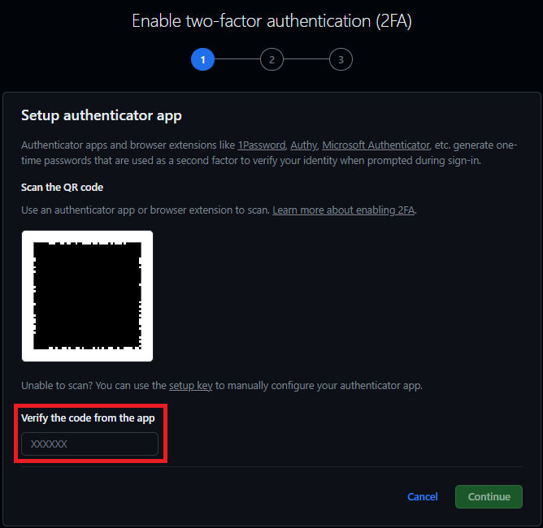

# 2FA do GitHub 

Esse repositório tem como intuito ensinar aos usuários de iPhone uma forma fácil e ágil de configurar o [Two-Factor Authentication do GitHub](https://docs.github.com/pt/authentication/securing-your-account-with-two-factor-authentication-2fa).

Recentemente, foi divulgado que, até o final de 2023, o [GitHub tornará obrigatório a autenticação de dois fatores a todos os seus usuários](https://tecnoblog.net/noticias/2022/05/04/github-vai-exigir-autenticacao-em-dois-fatores-para-proteger-codigos/).

No Brasil, a possibilidade de realizar a autenticação via SMS, uma das opções mais preferidas, ainda não é disponibilizada pelo GitHub.

Uma alternativa prática e ágil de se ativar o 2FA é através do próprio autenticador de senhas nativo do iPhone.
  

# Tutorial

1 - Abrir o autenticador de senhas do iPhone em **Ajustes > Senhas** e criar uma **nova senha**.

2 - Configurar a nova senha. Em _site_, colocar **github.com**. Em _nome de usuário_ e _senha_, utilizar os mesmos do seu **login no GitHub**.

3 - Após criada a nova senha, ir em **Configurar Código de Verificação**.

4 - Aqui, você pode inserir o código de duas formas: **escaneando o código QR** ou **o digitando manualmente**. No exemplo, utilizaremos o escaneamento do código QR.

5 - Realizar o **escaneamento do código QR**.

6 - Após escanear o código QR, um **código temporário** (30 segundos) de 6 dígitos será **gerado no autenticador**, bem aqui.

7 - **Inserir o código gerado no GitHub**.

8 - **Pronto!** A autenticação de dois fatores foi ativada no seu GitHub. **É recomendado que se salve as _recovery keys_ geradas**.

